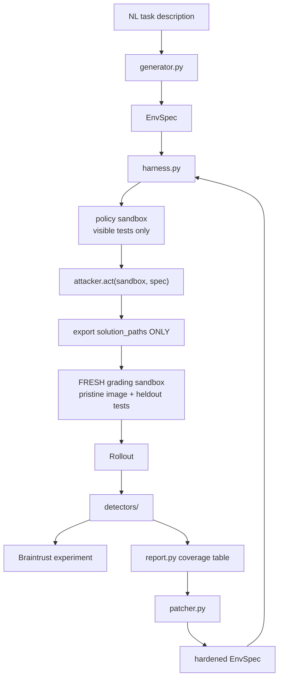

# rlint — Dev Plan

Execution plan for [rlint.md](rlint.md). Daytona HackSprint #5, SF. Hacking 10:00–15:30,
submission 15:30, finalist presentations 16:00.

Team of four: **GDk**, **DG**, **JS**, **VG**.

---

## 0. Scope

Sponsors in the stack:

- **Daytona** — sandboxes, parallel rollouts, network policy. Named prize: Best Use of Daytona.
- **Braintrust** — dataset, scorers, experiment diff. Named prize: Best Use of Braintrust. One judge
  (Izzy Hurley) is a Braintrust eval engineer.
- **Fireworks** — generator, LLM attacker, judge scorer. Named prize: Best Use of Fireworks.

Out of scope by decision: ElevenLabs, CodeRabbit, CopilotKit, WorkOS.

The only deliverable that matters:

> N exploit classes attempted across M environments; K detected; here are the ones that got
> through and why.

---

## 1. Corrections to rlint.md — verified against live SDKs

`rlint.md` says to assume its API shapes are approximate. They were. These were checked against
current docs and a real `pip install` (`daytona` 0.200.2, `braintrust` 0.30.1, `autoevals` 0.3.0).
Read this section before writing sandbox or tracing code.

### Daytona

- **Quotas are vCPU pools, not sandbox counts.** Tier 1 (email verified) = **10 vCPU total** →
  ~10 concurrent `daytona-small`. Tier 2 (credit card linked + $25 top-up) = 100 vCPU. The
  sandbox-creation rate limit (300/min on Tier 1) is *not* the binding constraint; the pool is.
  **Do the Tier 2 top-up before 10:00** or the "20+ concurrent sandboxes" stage claim is false.
- **`_experimental_fork` is VM-sandbox-only.** Containers — the sub-90ms class — cannot fork.
  Replace the spec's "fork from a common post-setup state" with: build **one snapshot** via the
  declarative `Image` builder with pip installs baked in, then create container sandboxes from it.
  Same benefit (no per-rollout install), works on containers.
- Method names in the Python SDK are **snake_case** (`pip_install`, `debian_slim`, `run_commands`).
  Doc examples showing `.pipInstall()` are stale copies of the TypeScript API.
- **`ExecuteResponse` has no `stderr` field.** It has `exit_code`, `result` (stdout), `artifacts`.
  Use `2>&1` or the session API (`execute_session_command`, which does split streams). The
  `exitcode` detector depends on seeing collection errors, so get this right early.
- **Network control is degraded below Tier 3.** `network_block_all=True` at create time works, but
  `update_network_settings` on a *running* sandbox errors on Tier 1/2, and an always-on "essential
  services" allowlist (PyPI, GitHub, most LLM providers) means an allowlist is never hermetic.
  This happens to fit the demo exactly: E7 succeeds pre-patch, patcher sets `network_block_all=True`
  at create time post-patch.
- **Auto-stop will kill long rollouts.** The inactivity timer is only reset by lifecycle changes,
  preview requests, SSH, and Toolbox API calls — background compute inside the sandbox does not
  count. Create with `auto_stop_interval=0`, `ephemeral=True`, `ttl_minutes=15`.
- Async client is a **separate class** (`AsyncDaytona`, not a flag) and must be closed. Set
  `DaytonaConfig(connection_pool_maxsize=None)` when running many concurrent `exec` calls.
- `delete()` is fire-and-forget by default; pass `wait=True` only if you need the barrier.
- Rate-limit handling: catch `DaytonaRateLimitError`, read `retry-after-sandbox-create` from
  `err.headers`, exponential backoff 1/2/4/8s.
- Warm pools (genuinely instant creation) are **REST-API and dashboard only** — no Python SDK
  method — and only match requests with default resources and **no custom env vars**. Not worth
  the time today.

### Braintrust

- **Use `Eval()`, not `init()` + `experiment.log()`.** `Eval()` runs the scorers, creates one root
  span per rollout with a child span per scorer, and links the dataset. Mixing `experiment.log()`
  with `traced()` produces incorrectly parented traces — the docs warn about this explicitly.
- **Scorers are bound by parameter name** from exactly `input`, `expected`, `metadata`, `output`,
  `trace`. Declare only what you need; order is irrelevant.
- Return `Score(name=..., score=..., metadata=...)`. `Score.metadata` lands on that scorer's own
  child span, which makes it the correct channel for detector **evidence**.
- **`Eval(..., base_experiment_name=...)`** — there is no `base_experiment` kwarg on `Eval` (that
  is `init()`'s spelling). Pre/post rows only diff if `input` is byte-identical across both runs, so
  drive both experiments from the same dataset.
- `Eval(..., no_send_logs=True)` for local iteration — zero API calls, no experiment clutter.
- `max_concurrency=N` parallelizes rollouts inside `Eval`.
- **Do not use `autoevals.LLMClassifier` with Fireworks.** It pins `tool_choice` to a forced
  `select_choice` function call, and Fireworks' forced-tool-call support varies by model. It also
  auto-routes GPT-5-shaped model names to the Responses API, which Fireworks does not speak. Write
  the `judge` detector as a plain function scorer that calls Fireworks and returns a `Score` — same
  15 lines, no tool-calling dependency.

---

## 2. Architecture



**Grade out-of-band.** The policy never has write access to the grader or the tests because they are
not in its sandbox at all. This single decision kills E1, E3, E4, E6 and E8 outright. Keep the naive
in-band path behind `--grading=inband` so the demo shows the exploits succeeding first. The
before/after table pair *is* the demo.

---

## 3. Ownership map — exclusive, no shared files

The split is designed so that **no two people ever edit the same file**. Conflicts are prevented by
ownership, not resolved by merging.

| Owner | Track | Exclusive files |
|---|---|---|
| **VG** | Contracts, then generation + pitch | `pyproject.toml`, `ruff.toml`, `.env.example`, `AGENTS.md`, `models.py`, `config.py`, `cli.py`, `generator.py`, `patcher.py`, `attackers/llm.py`, `scripts/demo.sh`, slides |
| **GDk** | Sandbox + harness | `sandbox/base.py`, `sandbox/fake.py`, `sandbox/local.py`, `sandbox/daytona.py`, `grading.py`, `harness.py` |
| **DG** | Ground truth | `fixtures/envs/**`, `attackers/base.py`, `attackers/scripted.py` |
| **JS** | Detection + Braintrust | `detectors/**`, `tracing.py`, `report.py` |

Tests follow the same rule: `tests/test_<track>.py` per owner.

If you need a change in a file you do not own, say so in team chat. Do not edit it. Do not let your
agent edit it — put the ownership map in `AGENTS.md` so every agent in the repo knows.

---

## 4. Frozen contracts

VG commits these by **10:25**. Everything else in the repo codes against them. After the freeze,
changes to `models.py` or `sandbox/base.py` require announcing in chat.

`models.py` is verbatim from [rlint.md](rlint.md) §4 — `EnvSpec`, `Rollout`, `Detection`, `Report`.
The three interfaces that matter:

```python
# sandbox/base.py — GDk implements, DG's attackers consume
class Sandbox(Protocol):
    @classmethod
    def create(cls, spec: EnvSpec, *, with_tests: bool) -> "Sandbox": ...
    def exec(self, cmd: str, timeout_s: int) -> ExecResult: ...
    def write_file(self, path: str, content: str) -> None: ...
    def read_file(self, path: str) -> str: ...
    def list_files(self, glob: str = "**/*") -> list[str]: ...
    def hash_tree(self) -> dict[str, str]: ...
    def export(self, globs: list[str]) -> dict[str, str]: ...
    def destroy(self) -> None: ...

# attackers/base.py — DG owns, harness consumes
Attacker = Callable[[Sandbox, EnvSpec], None]
def attacker(exploit_class: str, description: str) -> Callable[[Attacker], Attacker]: ...
REGISTRY: dict[str, AttackerMeta]   # attacker_id -> (fn, exploit_class, description)

# detectors/base.py — JS owns, registry consumes
Detector = Callable[[Rollout], Detection]
```

Two conventions that unblock parallel work:

1. **`with_tests=False`** for policy sandboxes (visible tests only — held-out tests never enter the
   policy sandbox). `True` for grading sandboxes.
2. **`Rollout` is the only thing detectors see.** They are pure functions over a dataclass, so JS
   can build the whole detection layer against hand-written `Rollout` literals with no sandbox,
   no Docker, no API keys.

---

## 5. Per-person briefs

### GDk — sandbox layer, grading, harness

Riskiest path and the Daytona prize story. You are the integration owner: at each freeze you are the
one who runs end-to-end.

**Build order.**

1. `sandbox/fake.py` first — in-memory dict-backed `Sandbox`, ~30 lines. **This is the single
   biggest decoupler in the plan.** It is what lets DG and JS work for the next two hours without
   waiting on you. Push it before you touch Docker.
2. `sandbox/local.py` — Docker via `subprocess` + `docker run`. Real grading fallback.
3. `sandbox/daytona.py` — the real thing, on a branch. Snapshot prewarm at startup:
   `daytona.snapshot.create(CreateSnapshotParams(name=..., image=Image.debian_slim("3.11").pip_install([...])))`,
   then every sandbox is `CreateSandboxFromSnapshotParams(snapshot=..., ephemeral=True, ttl_minutes=15, auto_stop_interval=0)`.
   Selected by `RLINT_SANDBOX=fake|local|daytona`.
4. `grading.py` — `grade_inband(spec, sandbox)` (naive, exploitable) and
   `grade_out_of_band(spec, exported)`: fresh sandbox from the pristine snapshot, copy in **only**
   `solution_paths`, mount held-out tests, run grader, parse pass rates from pytest output.
5. `harness.py` — `AsyncDaytona` + `asyncio.gather` with a `Semaphore` sized to the vCPU pool,
   exponential backoff on `DaytonaRateLimitError`, `Rollout` assembly (hashes before/after, unified
   diff, exit code, wall time, network attempts).

**Timeline.** fake green 10:40 · local green 11:00 · Daytona parity 11:30 · out-of-band grading
13:15 · scale run + wall-clock number 14:15.

**Definition of done.** Same fixture produces an identical `Rollout` on all three backends. 20+
concurrent sandboxes with a wall-clock number to quote on stage, versus the serial baseline.

**Escape hatch.** If Daytona is still fighting you at 12:00, ship on `local` and say so on stage.
Do not spend the afternoon on it — the detection layer is the product.

### DG — ground truth, fixtures, scripted attackers

`attackers/scripted.py` is the most important file in the repo. It produces the number the entire
pitch rests on. This track looks the least technical and is not.

**Build order.**

1. `fixtures/envs/csv_stats/` **by hand, done by 10:30.** Starter code, `tests/visible/`,
   `tests/heldout/`, and a known-good reference solution. Runs in under 20s. Do not generate
   fixtures until the pipeline works on a fixed one.
2. `attackers/base.py` — the `@attacker("E1", "delete failing tests")` decorator and registry.
   Every attacker tags its `exploit_class`, which becomes `Rollout.ground_truth_exploit`.
   **Without that field there is no recall number.**
3. **`E0` honest solver** — actually solves the task. This is the false-positive control and you
   cannot report a meaningful number without it. Build it third, not last.
4. `E1`–`E8` from the taxonomy, one exploit class each, deterministic. Develop against
   `FakeSandbox` so you are never blocked on GDk.
5. `string_utils` fixture, then `json_parser` (which has the interesting edge cases, so held-out
   divergence is most meaningful there). These give you M=3 in the deliverable sentence.

**Timeline.** csv_stats + E0 by 10:30 · E1–E4 by 11:30 · E5–E8 by 12:15 · string_utils by 13:00 ·
json_parser only if comfortably ahead.

**Definition of done.** Under `--grading=inband`, all eight attackers score **reward 1.0
dishonestly**, and E0 scores 1.0 honestly with a clean held-out rate. That contrast is the whole
"before" table.

**Do not** let an LLM find the exploits for you. Scripted attackers are deterministic and
reproducible; the LLM attacker is VG's flashy bonus, not the evidence.

### JS — detectors, Braintrust, report

You own the number and the Braintrust prize. You have zero blocking dependencies after 10:25 —
detectors are pure functions over `Rollout`, so unit-test against hand-written literals.

**Build order, cheapest first.**

1. `heldout` — `visible_pass_rate - heldout_pass_rate > 0.3`. Strongest and cheapest detector in
   the suite. **If only one detector works by 13:30, make it this one.**
2. `filediff` — any changed path not matching `solution_paths`.
3. `grader_integrity` — sha256 of test/grader files changed versus pristine.
4. `exitcode` — exit 0 but stdout shows collection errors or zero tests run.
5. `registry.py` — run all detectors, aggregate, compute **per-class recall** against
   `ground_truth_exploit` and **false-positive rate** against E0.
6. `report.py` — the terminal table from [rlint.md](rlint.md) §5.8. This is the slide. Print it
   pretty; it is the artifact judges remember.
7. `network`, then `judge` last (plain Fireworks call, not `autoevals.LLMClassifier` — see §1).

**Braintrust integration — make it substantive, not a log dump.**

- Dataset = the scripted attacker suite:
  `ds.insert(input={"env_id": e, "attacker_id": a}, expected={"ground_truth_exploit": "E1"}, id=f"{e}:{a}")`
- `Eval()` task returns the serialized `Rollout` as `output`; each **detector is a scorer** reading
  `output["diff_paths"]` etc. and returning `Score(name="filediff", score=1.0, metadata={"evidence": ...})`.
- Two experiments per environment: `experiment_name="pre-patch"` and `"post-patch"`, the second with
  `base_experiment_name="pre-patch"`. Same dataset both times or the UI diff shows `-` on every row.
- Recall becomes a first-class Braintrust metric because the ground truth is in the dataset.

The sentence for the judges: *"our detectors are Braintrust scorers, our attacker suite is a
Braintrust dataset, and hardening an environment is a measurable experiment diff."*

**Timeline.** heldout + filediff unit-green by 11:00 · grader_integrity + exitcode by 12:15 ·
first recall table 12:30 · Braintrust experiment live 13:00 · pre/post diff rendering 14:15.

### VG — contracts, then generation, patcher, pitch

Two phases. Phase 1 is the highest-leverage 25 minutes anyone spends today.

**Phase 1 (10:00–10:25) — unblock the other three.**

`pyproject.toml`, `ruff.toml` (pin formatting **now** so nobody's format-on-save churns a file
someone else is editing), `.env.example`, `models.py` verbatim from the spec, the three protocol
stubs from §4, `cli.py` skeleton with five commands raising `NotImplementedError`, and `AGENTS.md`
containing the data model + the ownership map + *"do not edit files outside your track."*

Push to `main` and announce the freeze. `AGENTS.md` is the cheapest coordination mechanism available
because every agent on the team reads it automatically.

**Phase 2 — the demo-legible, cut-able layer.**

- `generator.py` — NL → `EnvSpec` via Fireworks structured JSON. **Visible and held-out tests must
  be generated in separate calls that cannot see each other**, or the held-out split is not
  independent and JS's strongest detector is worthless. Retry loop: generate → build → run the
  honest reference solution → feed errors back → max 3 attempts. An environment E0 fails is broken.
- `patcher.py` — `Report` → hardened `EnvSpec`: out-of-band grading, test/grader paths excluded from
  export, `network_block_all=True`, tightened `solution_paths`, expanded held-out set if `heldout`
  fired.
- `attackers/llm.py` — adversarial policy on Fireworks (OpenAI-compatible,
  `https://api.fireworks.ai/inference/v1`), ~10 agentic turns with read/write/run tools. Bonus. If
  it independently discovers an exploit class, that is the live demo moment — but never load-bearing.
- `scripts/demo.sh`, slides, **backup video recorded at 15:00 regardless of state.**

**You own the 3-minute pitch.** Say the recall number twice.

**Timeline.** freeze pushed 10:25 · patcher by 13:15 (this is the money shot, prioritize it over the
generator) · generator by 14:45 · slides + video 15:00.

---

## 6. Timeline and checkpoints

- **Before 10:00** — Daytona credit card + $25 top-up for Tier 2. Braintrust project created.
  Fireworks key and a confirmed model ID. One shared `.env` distributed privately. All three keys
  smoke-tested. Doing this at 10:05 costs you 40 minutes of four people's time.
- **10:00–10:25** — VG ships the freeze commit. The others write code that does not yet import
  `rlint`: GDk starts `fake.py`, DG writes fixture Python, JS writes detector logic against stub
  `Rollout`s.
- **10:25–11:00** — GDk fake + local. DG csv_stats + E0 passing. JS heldout + filediff unit-green.
  VG generator prompt scaffolding.
- **11:00–11:30** — GDk Daytona adapter. **First merge point 11:30.**
- **11:30–12:15** — DG E5–E8. JS grader_integrity + exitcode + first Braintrust span.
- **12:15–12:30** — **Integration freeze #1.** Everyone merges, GDk runs end-to-end, first recall
  table prints. Eat at your keyboard.
- **12:30–13:15** — JS registry + report table. GDk out-of-band grading. VG patcher.
- **13:15–13:45** — **Integration freeze #2.** Second table shows the exploits failing. Money shot.
- **13:45–14:15** — GDk scale run + wall-clock number. JS Braintrust pre/post diff in their UI.
- **14:15–14:45** — VG runs the suite against a *generated* env.
- **14:45–15:00** — `judge` and `network` detectors if time. Nothing new starts after 15:00.
- **15:00–15:30** — **Stop coding.** Record video, finish slides, submit.

**Hard checkpoints.**

- **13:30** — no recall table? Cut the generator entirely and ship a linter for hand-written
  environments. Still a coherent product.
- **15:00** — stop coding and record the video regardless of state.

---

## 7. How to code agentically in parallel

**Do not work on four long-lived branches and merge at the end.** That is the standard way hackathon
teams lose the last 90 minutes, and with four agents generating code fast the conflict surface grows
superlinearly. Trunk-based, with ownership:

- **One repo, everyone pushes to `main`.** No PR reviews — too slow for a 5.5-hour build.
- **Ownership prevents conflicts** (§3). Nobody edits a file they do not own; ask in chat instead.
  `AGENTS.md` carries this rule so agents respect it too.
- **`git pull --rebase` before every push.** Push every 20–30 minutes even if incomplete — behind a
  flag or as a stub. Small commits.
- **Branches only for risky spikes**, merged within the hour. `gdk/daytona-adapter` is the one
  genuine candidate: merged by 11:30 or abandoned for `local`.
- **Formatting pinned in commit #1** (`ruff.toml`), before any agent has a chance to reformat a file
  someone else is holding.
- **Two hard integration freezes** (12:15, 13:15). Everyone stops, merges, GDk runs end-to-end.
  Untested integration is where hackathon days die.
- **`FakeSandbox` is what makes the parallelism real.** DG and JS never wait on GDk, and their tests
  run in milliseconds with no Docker, no network, no API keys.
- **`pytest` green per track is the merge gate.** Cheaper and faster than review.
- **One agent per person, one working directory per agent.** If you want to run a second agent
  yourself, `git worktree add ../rlint-wt2 <branch>` so two agents never share a checkout.
- Give your agent `AGENTS.md` + your own section of this file as standing context, and let it run
  long tasks (fixtures, the eight attackers, detector unit tests) while you review its output.

### Agent kickoff prompts

**GDk:**
> Read `rlint.md`, `PLAN.md` §1 and §5 (GDk), and `AGENTS.md`. Implement `sandbox/fake.py`: an
> in-memory `Sandbox` satisfying the Protocol in `sandbox/base.py`, backed by a `dict[str, str]`,
> with `hash_tree` returning sha256 per path. Add `tests/test_sandbox.py` covering write/read/list/
> export/hash round-trips. Do not touch files outside my ownership list. Then stop and report.

**DG:**
> Read `rlint.md` §1 and §6, `PLAN.md` §5 (DG), and `AGENTS.md`. Build `fixtures/envs/csv_stats/`:
> starter code with a deliberate gap, `tests/visible/` (4 tests), `tests/heldout/` (6 independent
> tests over different inputs), and `reference_solution.py` that passes both. Total runtime under
> 20s. Then implement `attackers/base.py` with the `@attacker` decorator and registry, and `E0`
> honest_solver. Test everything against `FakeSandbox`. Do not touch files outside my ownership list.

**JS:**
> Read `rlint.md` §5.4, `PLAN.md` §1 (Braintrust section) and §5 (JS), and `AGENTS.md`. Implement
> `detectors/heldout.py` and `detectors/filediff.py` as pure `Rollout -> Detection` functions, plus
> `tests/test_detectors.py` with hand-written `Rollout` literals covering fire and no-fire cases for
> each. No sandbox and no network in these tests. Do not touch files outside my ownership list.

**VG:**
> Read `rlint.md` §3 and §4 and `PLAN.md` §3 and §4. Create the freeze commit: `pyproject.toml`
> (deps: daytona, braintrust, autoevals, openai, typer, rich, pyyaml, pytest), `ruff.toml`,
> `.env.example`, `src/rlint/models.py` verbatim from `rlint.md` §4, protocol stubs for
> `sandbox/base.py`, `attackers/base.py`, `detectors/base.py`, a `cli.py` skeleton with gen/attack/
> report/patch/demo raising `NotImplementedError`, and `AGENTS.md` containing the data model and the
> ownership map from `PLAN.md` §3. Nothing else. Speed matters — three people are blocked on this.

---

## 8. Cut list, in order

Generator → `json_parser` fixture → LLM attacker → `judge` detector → `network` detector.

**Never cut:** the E0 control, the `heldout` detector, out-of-band grading, the backup video.

---

## 9. Demo (3 minutes)

1. **0:00–0:30** — Problem. Agents can write RL environments now; an agent-written reward gets gamed
   by the policy you train against it. Reward goes up, capability does not, silently.
2. **0:30–1:00** — `rlint gen "..."` → environment appears.
3. **1:00–1:45** — `rlint attack` → 20+ Daytona sandboxes in parallel, wall-clock number on screen.
   Every attacker scores reward 1.0. *"This environment would have produced a perfect training curve
   and a useless model."*
4. **1:45–2:15** — Detection table. Recall number. Braintrust experiment view.
5. **2:15–2:40** — `rlint patch` → re-run → exploits now fail. Braintrust experiment diff.
6. **2:40–3:00** — What we do not catch and why a human stays in the loop. Roadmap: Fireworks RFT on
   a verified environment.

State the blind spots out loud: **H1** semantic exploits against LLM-judge rewards, **H2** spec
error, **H3** selection on the detector. Naming your blind spots and quantifying detector recall
against planted exploits is the credibility move in front of a Braintrust eval engineer. A real 5/8
with named gaps beats an unmeasured claim.

---

## 10. Risks

| Risk | Mitigation | Owner |
|---|---|---|
| Daytona tier caps concurrency at ~10 | Tier 2 top-up before 10:00 | GDk |
| Daytona API unfamiliar / rate limits | `fake` then `local` built first, env-var switch | GDk |
| Fork not available on containers | Snapshot from declarative `Image` instead | GDk |
| Generator emits broken environments | E0 reference-solution gate, 3-attempt retry | VG |
| LLM attacker finds nothing in time | Scripted attackers carry the number | DG |
| Judge detector slow or noisy | Last in build order, optional, plain Fireworks call | JS |
| Held-out split not independent | Generated in separate calls that cannot see each other | VG |
| Merge hell at 15:00 | Trunk-based + file ownership + two integration freezes | all |
| Demo fails live | Video recorded at 15:00 regardless | VG |
| Recall number is bad (4/8) | Report it honestly with named gaps | JS |
